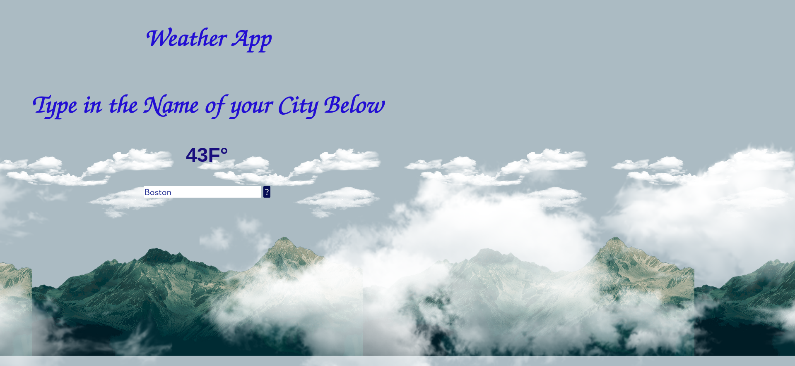

<h1 align="center">My Weather App</h1>

  This program uses an API call to fetch the weather from any given city. This program works for all international cities as well. Simply type in the name of the city and click the question mark. 

## Links

- [Repo](<https://github.com/naderhassan001/Weatherapp> "<project-name> Repo")

- [Live](<http://myweatherappannimated.s3-website-us-east-1.amazonaws.com/> "Live View")

## Screenshots

## Options for Running the Program 

In the project directory, you have a few options.

You can open the index.html file in a web browser or with the extention "liver server" in VsCode or your favorite editor. 

## Built With

- JavaScript
- HTML
- CSS

## Future Updates

- [ ] I am changing the API that is called. I am planning another one that allows for both the city and country. 
## Author

**Nader Hassan**

- [Profile](https://github.com/naderhassan001 "Nader Hassan")
- [Email](mailto:nader.hassan001@gmail.com "Hi!")

## 🤝 Support

Contributions, issues, and feature requests are welcome!

Give a ⭐️ if you like this project!
